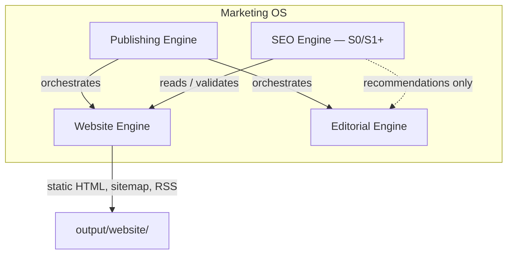

# S0 — SEO Engine Architecture

**Sprint:** S0 (SEO Readiness, Origin Abstraction & Baseline)  
**Agent:** ATLAS  
**Status:** Architecture definition — no production SEO activation  
**Architecture baseline:** v2.2 (frozen)  
**Platform Agent Registry:** v1.0 (frozen)

---

## 1. Purpose

Define the **SEO Engine** boundary under Marketing OS so implementation (S1+) can proceed without a ratified production domain. The SEO Engine analyzes and validates; it does **not** render pages, orchestrate publishing, or deploy.

---

## 2. Placement in Marketing OS

| Engine | Owns | Does NOT own |
|--------|------|--------------|
| **SEO Engine** | SEO analysis, metadata validation, indexability rules, canonical policy validation, structured-data validation, internal-link analysis, SEO readiness scoring, sitemap/feed validation, recommendations | Rendering, HTML output, publish orchestration, human approval, deploy, DNS, Search Console |
| **Website Engine** | Markdown→HTML, metadata emission, slug/canonical build, sitemap/RSS artifact generation, static provider | SEO scoring, keyword optimization, search submission |
| **Publishing Engine** | Job state machine, channel routing, audit trail | Page content, SEO rules |
| **Editorial Engine** | Human approval boundaries, editorial workflow | SEO activation, canonical ratification |

---

## 3. SEO Engine module layout (S0 foundation)

| Path | Role |
|------|------|
| `src/tools/site_origin.py` | Shared **SITE ORIGIN** contract (env-driven, placeholder default) |
| `src/tools/seo_engine/` | SEO Engine package (S0: readiness read model) |
| `src/tools/seo_engine/readiness.py` | Deterministic readiness evaluation |

Future S1+ slices may add:

- `src/tools/seo_engine/policy.py` — indexability / canonical policy rules
- `src/tools/seo_engine/indexing.py` — activation gates (no auto-submit)
- API routes under `/api/v1/seo/` (additive, not in S0)

---

## 4. SEO Engine capabilities (authorized scope)

| Capability | S0 | S1 target |
|------------|----|----|
| SEO readiness read model | ✅ defined + minimal impl | expand rules |
| Metadata validation | ✅ via readiness | full rule set |
| Canonical policy validation | ✅ origin alignment checks | policy engine |
| Structured-data validation | ✅ presence check | schema lint |
| Internal-link analysis | ✅ basic count | graph analysis |
| Sitemap/feed validation | ✅ artifact cross-check | full URL policy |
| Indexability rules | ✅ safety gates in `site_origin` | robots policy |
| SEO recommendations | doc-only | structured output |
| Search engine submission | ❌ blocked | ❌ blocked until domain ratified |

---

## 5. Data flow

1. **Content bundles** (`input/*/05_Final.md`) supply front matter including optional `canonical_url`.
2. **Website Engine** renders HTML + `metadata.json` + feeds using configured origin when FM canonical absent.
3. **SEO Engine** reads artifacts (offline, no network) and produces `ReadinessReport` with ERROR / WARNING / INFO findings.
4. **Publishing Engine** continues to own when content is published; SEO Engine does not gate publish in S0.

---

## 6. Origin dependency

All absolute public URLs (canonical, sitemap `loc`, RSS `link`, OpenGraph `og:url`, Schema.org `@id`/`url`) must ultimately derive from:

- Front-matter `canonical_url` (content identity), **or**
- `FOUNDER_SITE_ORIGIN` + `FOUNDER_SITE_BASE_PATH` (runtime default)

See `S0_SITE_ORIGIN_CONTRACT.md`.

---

## 7. Explicit non-goals (S0)

- Production SEO activation
- Search Console / analytics integration
- Paid SEO SaaS
- DNS or domain changes
- Rewriting M-Series frozen evidence
- Website Engine redesign

---

## 8. Toolchain (S1/S2 reuse)

| Tool | Use |
|------|-----|
| Python 3.x + pytest | Readiness tests, origin tests |
| `html.parser` / regex | HTML metadata extraction |
| Website Engine artifacts | Baseline input for readiness |
| `src/tools/metadata_checker.py` | Future FM validation reuse |
| `src/tools/content_quality_checker.py` | Pattern for deterministic scoring |

**Paid tools required:** 0

---

## 9. Verdict

**SEO Engine Architecture:** READY — boundary defined, S0 foundation modules in place, no production activation.
